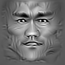
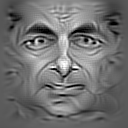
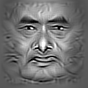
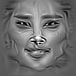
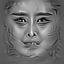

Visualize faces in a face recognition model.

The model can be downloaded from
https://github.com/AlfredXiangWu/face_verification_experiment .
This model is trained with CASIA-webface, People_ID can be set from 1 
to 10575, to get the memorized face of the corresponding person.

Here are some generated face memoriezed by the recoginition model mentioned above :

Bruce Lee:

Mr Bean:

Yun-Fat Chow:

Bingbing Li:

Bingbing Fan:

Yes, they are not as beautiful as they in the real world. If you feel not comfortable with these images,
please contact me, I will remove them.
