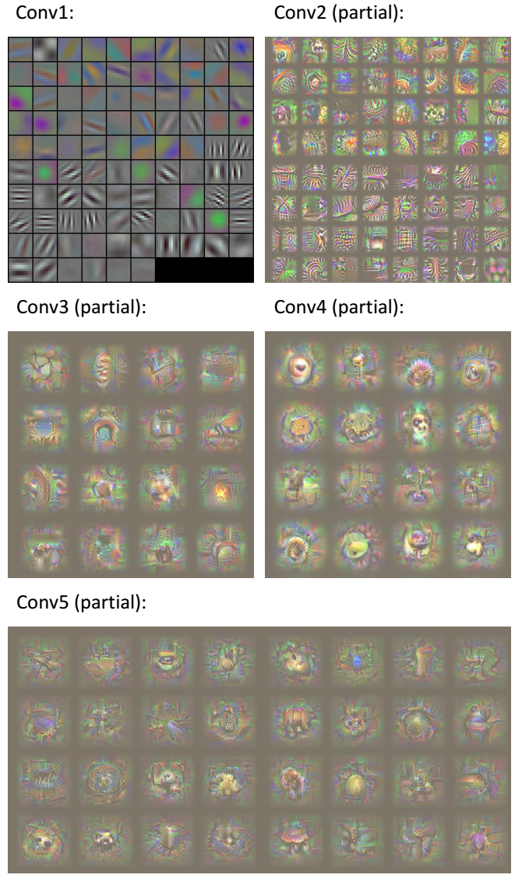
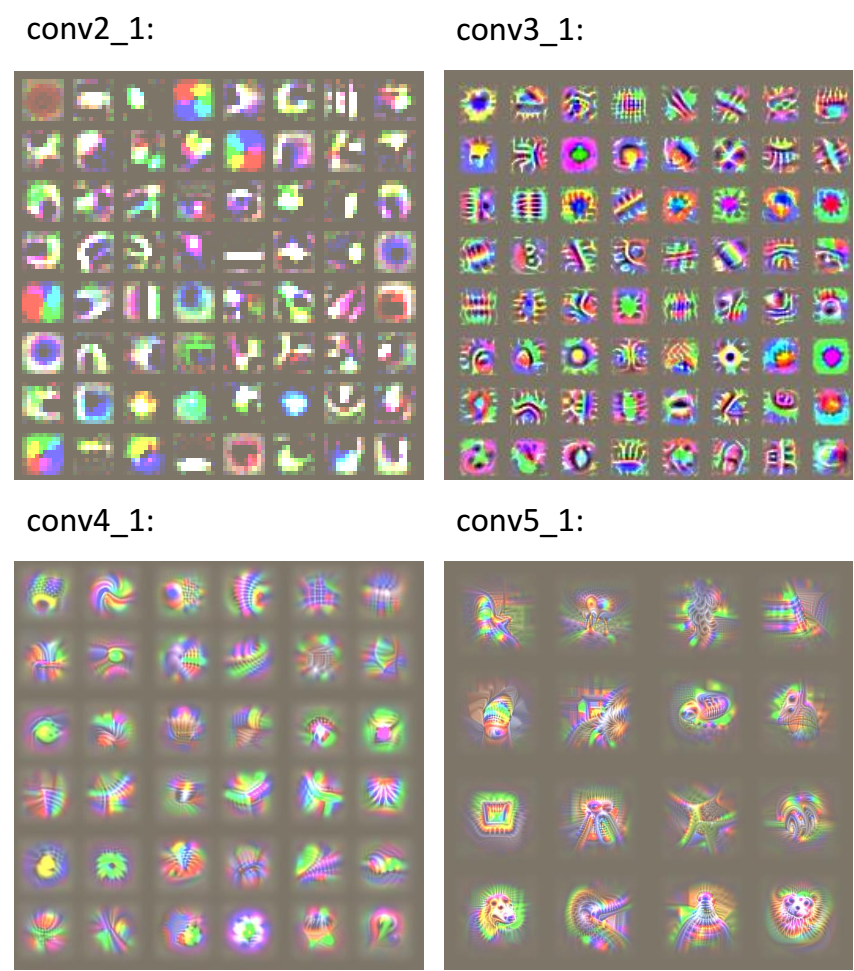
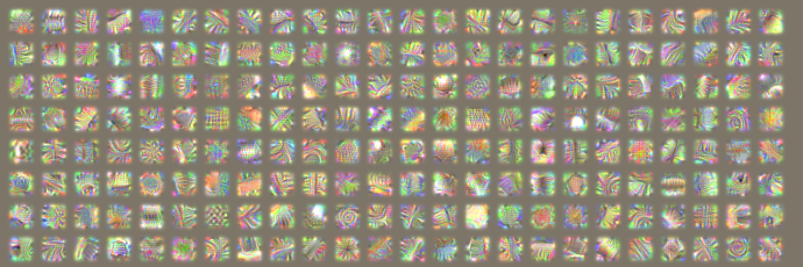
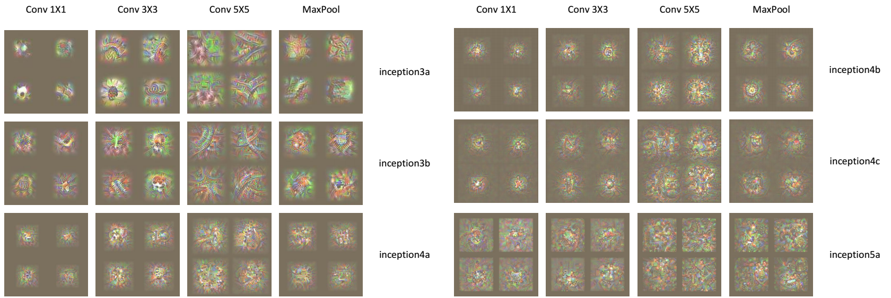

# Visualization of the mid-level filters in any networks.

This is the codes for reproducing the results in my paper, Visualizing Deep Neural Network by Alternately Image Blurring and Deblurring.

http://www.sciencedirect.com/science/article/pii/S0893608017302095

The codes are not well organized and need some specail skills to tune the hyper-paramters, 
such as learning rate and the gaussian std of the blur kernel.
I am attempting to reduce the parameters or find a way to automatically set them.

# Gallery

AlexNet:

VGG:

GoogLeNet conv2:

GoogLeNet Inceptions:

