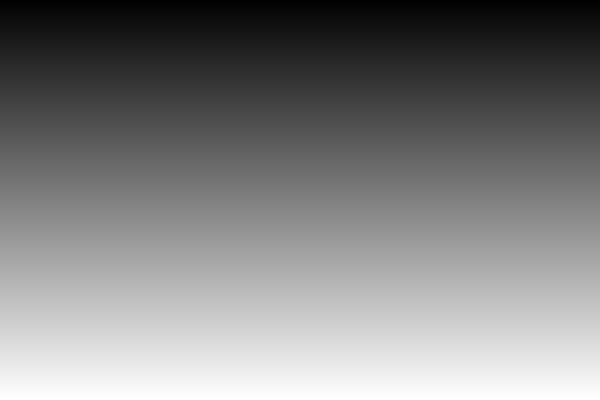
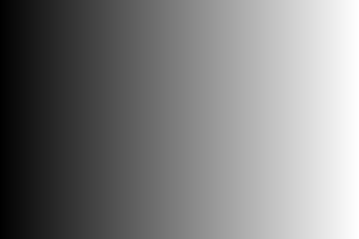
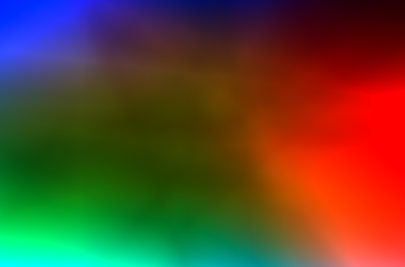
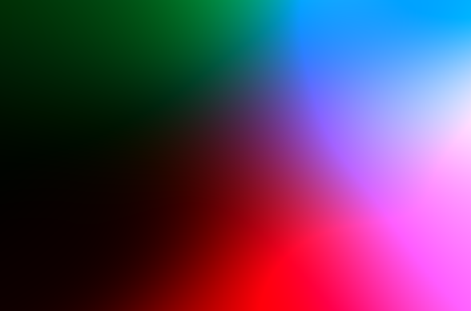
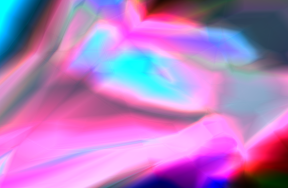
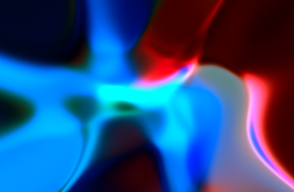

Visualize how complex the neural network's fitting function can achieve, w.r.t. width, depth and structure.

`CNNComplexity.m` is our main script. You can also use `CNNComplexitySave.m` and `run_save.m` to generate more images at once. 

These codes are from a failed work. If you can read Mandarine, please see this blog for details http://blog.csdn.net/happynear/article/details/46583811 .
I have underestimated the effect of scale & shift in Batch Normalization. **They are very important!**

However, I don't want this work to be thrown into dust basket. I still think that we can get some interesting and direct feelings from the generated images. 

Brief Algorithm Description
----------

Firstly we take an two channel "slope" image as input.

| first channel         | second channel        |
| ----------------------|:---------------------:|
|     |     |

Then we use a randomly initialized (convolutional) nerual network to wrap the slope input to some more complex shapes. Note that a neural network is continuous function w.r.t. the input, the output will also be a continuous but more complex image.

In order to control the range of each layers' output, we add batch normalization after every convolutional layer as introduced in the original paper. BTW, since we have only one input image, the name "batch normalization" is better to be changed to "spatial normalization". Without the spatial normalization, the range of the output will get exponential increasement or decreasement with the depth, which is not what we want.

Now we can see how complex the neural network could be. Firstly, with a single layer, 100 hidden channels.

| ReLU activation          | Sigmoid activation          |
| -------------------------|:---------------------------:|
|  |  |

How about 10 layers with 10 hidden channels respectively?

| ReLU activation           | Sigmoid activation            |
| --------------------------|:-----------------------------:|
|  |   |

Much more complex, right? Please note that they all have about 100 paramters, but with deeper structure, we produce images with a huge leap in complexity.

We can also apply other sturctures on the input, such as NIN, VGG, Inception etc, and see what's the difference of them. Now, try it yourself!
