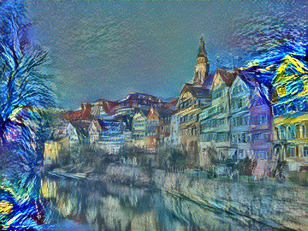

A Caffe Implementation of Neural Art
============

Based on paper
> A Neural Algorthm of Artistic Style' by Leon Gatys, Alexander Ecker, and Matthias Bethge (http://arxiv.org/abs/1508.06576).

The model used here is VGG-16. I have thinned the net model with only conv layer paramters retaining. The thinned model can 
be downloaded from http://pan.baidu.com/s/1kT8d3Iv .

Usage
===========

Open `NeuralArtDemo.m` by Matlab, modify the path to style image and content image, then run it.

I exploited this on my laptop and it's too slow to tune the parameters to be the best. The performance is not very good right now. However, you can still try it.

For caffe linux users: I have written a new layer called [*gram layer*](https://github.com/happynear/caffe-windows/blob/master/src/caffe/layers/gram_layer.cpp) to calculate the gram matrix of a feature map. If you want to run this code with your own caffe, please add this layer to your caffe project.

I have replaced the Euclidean loss with smoothL1 loss to get better numerical stability and faster convergence speed. You can change it back to Euclidean loss in `MakeStylePrototxt.m` line 31. With smoothL1 loss, we need only 200 iterations to get a satisfying result, while we need 500 for Euclidean.

Gallery
===========
style: starry night   content: tubingen

I haven't add total-variance norm prior on this image because it is difficult for my laptop to tune the parameter of it, so this image may be not very smoothy.
